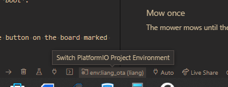

# LiaNG

This is a software for the next generation of Liam, called LiaNG.

The used hardware is LiamNG_V1.2 and you can find it [here](https://oshwlab.com/jonasforssell/Liam5_Shield-moUbtnFzR_copy_copy_copy)

Take care, this software is still in an early stage and is incomplete, buggy and... well... pre-alpha.

Fork it at you own risk, major refactoring is likely :)

The code is prepared for development in VSCode/PlatformIO, but will work in other IDE altough when you get the library depencies sorted out.

## Getting started

1. Compile and upload the program

2. Upload the files in /data to the SPFISS area.

3. Connect to the temporary wifi accesspoint provided by LiaNG.

4. Surf to http://10.0.2.1/settings.html and enter your Wifi connection details.

5. After successful connection to the wifi LiaNG will report its IP in the serial and on the display if you have one connected.

## OTA (Over-The-Air) updates

LiaNG supports OTA updates directly from within VSCode with PlatformIO. First be sure to have your computer connected to the same network as LiaNG. Next go to the file `platformio.ini` at the root of the repository and change the line `upload_port =` to the IP of your mower.

```ini
[env:liang_ota]
upload_protocol = espota
upload_port = 10.0.2.1 # <--- This IP
upload_flags = -p 8266
```

Press `Ctrl + Shift + P` and type `PlatformIO: Pick Project Environment` and select `env:liang_ota`. You can also select the environment from the bottom bar in VSCode.

[

Now you can press `Ctrl + Alt + U` to build and upload the firmware to your mower.

> **Note**
>
> If you get an error message such as this
> ```
>11:51:08 [INFO]: Waiting for device...
>11:51:18 [ERROR]: No response from device
>*** [upload] Error 1
>```
> it's probably an indication that your computers firewall is blocking the upload.
>
> Allow VSCode/PlatformIO through the firewall and try again.

## Modes
Liang is using modes to select the overall goal for the mower at any given time. A mode implies the use of different behaviors to achieve that goal. The modes are *Idle*, *Charge*, *Mow* and *Mow Once*

Modes can be changed from the web UI or by pressing the center button on the board marked *boot*.
### Idle
The mower is passive and only a few debug and testing behaviors are available
Two debug behaviors are available in Idle mode. *Sensor debug* and *motor test*. Press the button on the board marked *SW3* to cycle through them.
### Charge
The goal is to be charging and stay in charging until told otherwise.
### Mow
The mower aims to mow and charge in a ever repeating cycle. Mowing starts when the battery is full.
### Mow once
The mower mows until the battery is low and then the mode changes to *Charge*. **Mowing starts immediately when *Mow Once* is activated**

